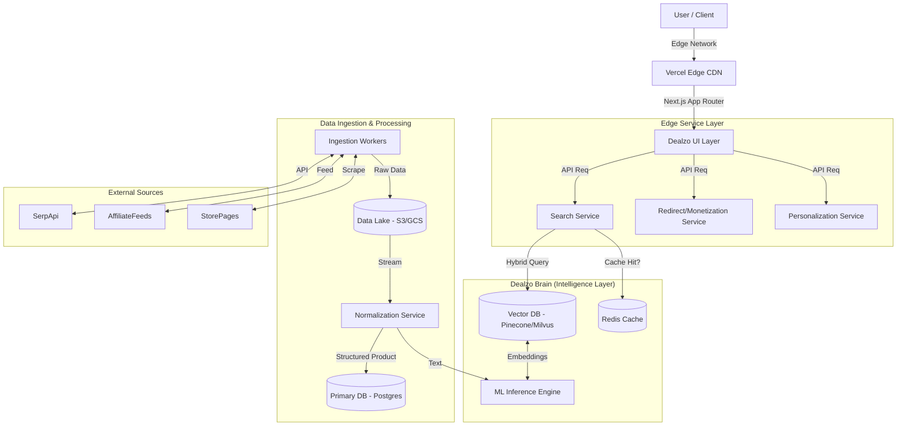

# DealzoShop: Commerce Intelligence Engine - System Architecture

## 1. Executive Summary
DealzoShop is evolving from a static price comparison site into an autonomous, real-time **Commerce Intelligence Engine**. This document outlines the architectural blueprint for "Dealzo Brain," a system capable of real-time data fusion, vector-based product understanding, and AI-driven decision making.

## 2. High-Level System Architecture

The system follows a **Composable Microservices Architecture** hosted primarily on **Vercel (Edge Network)** for frontend/API and **Cloud Worker Nodes** (AWS/GCP) for heavy data processing.

## 3. Core Modules & Components

### 3.1. Real-Time Data Fusion Layer (`Dealzo-Ingest`)
*   **Purpose**: Aggregates data from disparate sources into a unified stream.
*   **Components**:
    *   **API Connectors**: Handlers for SerpApi, Amazon PA-API, Flipkart API.
    *   **Feed Parsers**: High-throughput XML/CSV parsers for affiliate feeds (CJ, Impact, vCommission).
    *   **Micro-Scrapers**: Headless browser workers (Puppeteer/Playwright) for sites without APIs.
*   **Pipeline**: `Raw Source` -> `Validation` -> `Deduplication` -> `Normalization Queue`.

### 3.2. Autonomous Product Intelligence (`Dealzo-Normalize`)
*   **Purpose**: Understands what a product *is*, regardless of how it's named.
*   **Capabilities**:
    *   **SKU Normalization**: Maps "iPhone 15 128GB Blk" and "Apple iPhone 15 (Black, 128 GB)" to a single `CanonicalProduct`.
    *   **Vector Embeddings**: Generates 768-dim vectors (using OpenAI `text-embedding-3-small` or open-source `all-MiniLM-L6-v2`) for titles and descriptions.
    *   **Spec Extraction**: NLP models to extract `RAM`, `Storage`, `Color`, `Processor` from unstructured text.

### 3.3. AI Decision Engine (`Dealzo-Brain`)
*   **Purpose**: The "Cortex" that makes decisions on ranking and recommendations.
*   **Logic**:
    *   **Smart Ranking Score**: `(0.4 * PriceScore) + (0.3 * TrustScore) + (0.2 * DeliverySpeed) + (0.1 * UserAffinity)`.
    *   **Price Prediction**: Time-series model (Prophet/ARIMA) to predict "Buy Now" vs "Wait".
    *   **Recommendation Engine**: Collaborative filtering based on user browsing history and vector similarity.

### 3.4. Advanced Affiliate & Monetization Engine
*   **Purpose**: Maximizes revenue per click.
*   **Features**:
    *   **Dynamic Link Rewriting**: Centralized logic to swap domains (e.g., `amazon.in` -> `amzn.to`) on the fly.
    *   **Merchant Router**: If Product X is ₹500 on Amazon (2% comm) and ₹500 on Flipkart (5% comm), prioritize Flipkart.
    *   **Fraud Guard**: Detects bot clicks and prevents affiliate tag stuffing.

## 4. Data Flow Pipeline

1.  **Ingest**: Worker node fetches "Sony WH-1000XM5" from 10 sources.
2.  **Normalize**:
    *   Source A: "Sony XM5 Wireless" -> `ID: sony-wh1000xm5`
    *   Source B: "WH-1000XM5/B" -> `ID: sony-wh1000xm5`
3.  **Enrich**: Fetch high-res images, reviews, and specs.
4.  **Index**:
    *   Store structured data in **PostgreSQL** (Supabase/Neon).
    *   Store vector embeddings in **Pinecone**.
    *   Cache hot data in **Redis** (Upstash).
5.  **Serve**: User searches "Sony headphones".
    *   **Hybrid Search**: Keyword match (BM25) + Vector Semantic Match.
    *   **Rerank**: Apply `Smart Ranking Score`.
    *   **Response**: Return JSON to frontend < 100ms.

## 5. Technology Stack

*   **Frontend**: Next.js 15 (App Router), React Server Components, Tailwind CSS, Framer Motion.
*   **Edge Compute**: Vercel Edge Functions (for API routing and lightweight logic).
*   **Backend Workers**: Python (FastAPI) or Node.js containers on AWS Lambda / Google Cloud Run (for scraping/ML).
*   **Database**:
    *   **Primary**: PostgreSQL (Relational Data).
    *   **Vector**: Pinecone or Weaviate (Semantic Search).
    *   **Cache**: Redis (Performance).
*   **AI/ML**: OpenAI API (Embeddings/LLM), TensorFlow/PyTorch (Custom models).

## 6. Scalability Roadmap (0 to 10M Users)

### Phase 1: Foundation (Current)
*   Next.js Monolith.
*   Real-time API calls to SerpApi.
*   Basic Caching.

### Phase 2: Decoupling (10k - 100k Users)
*   Introduce **Redis** for aggressive caching of search results.
*   Implement **Background Workers** (Cron jobs) to pre-fetch prices for popular items (top 1000 products).
*   Start building the **Product Catalog DB** (Postgres) to reduce dependency on real-time external APIs.

### Phase 3: Intelligence (100k - 1M Users)
*   Deploy **Vector Search** for "concept" searching (e.g., "best camera phone under 20k").
*   Implement **User Personalization** (Feed based on history).
*   Launch **Price Alert System** (Email/Push notifications).

### Phase 4: Hyper-Scale (1M+ Users)
*   **Event-Driven Architecture**: Kafka/RabbitMQ for data pipelines.
*   **Edge Caching**: Cache HTML at the edge (Vercel ISR).
*   **Federated Search**: Distributed search nodes.

## 7. Security & Compliance
*   **GDPR/DPDP Compliance**: Strict user data isolation.
*   **Affiliate Compliance**: Adhere to Amazon Associates & ONDC operating policies.
*   **Bot Protection**: Cloudflare WAF + Rate Limiting.

## 8. Revenue Maximization Algorithms
*   **"The Nudge"**: If a user hovers over a product but doesn't click, show a "Price dropped by 5% yesterday" badge.
*   **Bundle Logic**: Suggest "Phone + Case" combos where the accessory has high margin.
*   **Exit Intent**: Pop-up with "Sign up for price drop alert" when cursor leaves window.
